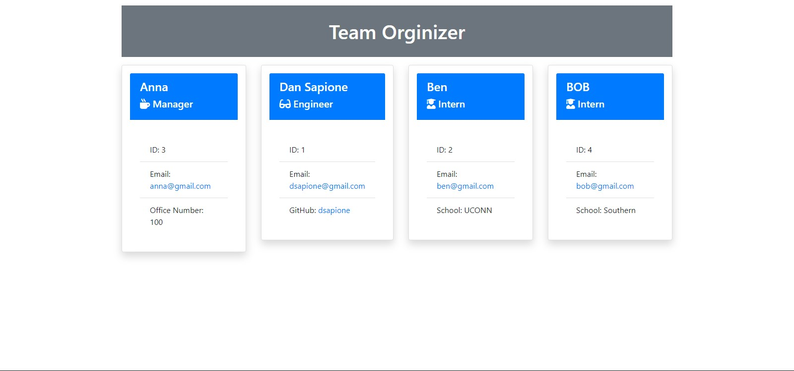

# Team Organizer

## Description

Prompts a user to input information about memebers on their team and organizes it into a easy to read HTML webpage.

## Table of Contents

* [Installation](#installation)
* [Usage](#usage)
* [Contributing](#contributing)
* [Tests](#tests)
* [Questions](#questions)

## Installation

Once the project is downloaded type "npm i" into your command bar to download the neccesarry inquirer, and jest dependecies.

## Usage

Run 'node index.js' on the cmd line to start the application which will then use inquirer to prompt questions about your project to generate a index.html. Once built it will be displayed in the dist. folder.

## Contributing

Standard practice for contribution

## Tests

Once all the dependencies are downloaded you can run "npm test" to start test on this project.

## Questions

If you have an questions feel free to contact me via [Email](dsapione@gmail.com)
and checkout my other projects on [GitHub](https://github.com/dsapione).